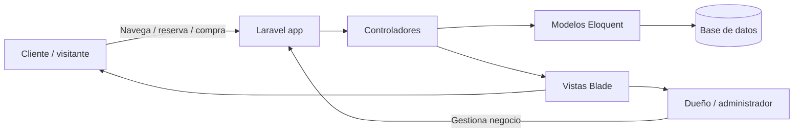
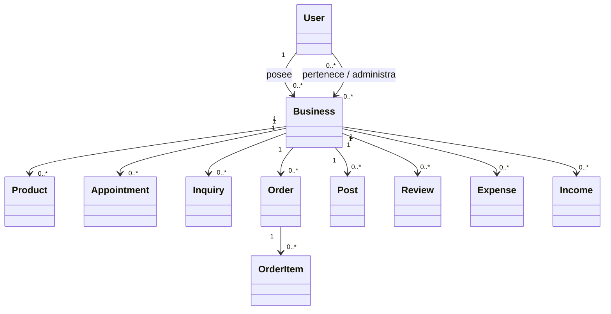

# Arquitectura del sistema

## 1. Visión general

Impulso es una plataforma web orientada a la gestión de emprendimientos locales. Su objetivo es unificar en una sola aplicación la presencia pública del negocio y la operación interna del mismo.

El sistema está compuesto por dos grandes frentes:

- portal público para clientes y visitantes,
- panel privado de administración para dueños y miembros del negocio.

## 2. Principios arquitectónicos

- Separación de responsabilidades por capas: rutas, controladores, modelos, vistas y persistencia.
- Uso de Laravel como framework base con Eloquent para acceso a datos.
- Enfoque en negocio local: turnos, stock, pedidos, finanzas y contenido comercial.
- Seguridad por validación de datos, autorización y autenticación autenticada.

## 3. Arquitectura lógica

## 4. Capas del sistema

### 4.1 Capa de presentación

Se implementa con Blade templates y assets gestionados por Vite.

Incluye:

- vista pública del emprendimiento,
- catálogo de productos,
- panel de gestión,
- personalización visual,
- formularios de reservas, consulta, pedidos y publicaciones.

### 4.2 Capa de aplicación

Los controladores gestionan las acciones de negocio y validan las entradas del usuario. En la aplicación actual se observan controladores especializados para:

- autenticación: AuthController,
- negocios: BusinessController,
- panel y gestión: ManagementController,
- inventario: ProductController,
- turnos: ManagementController,
- pedidos: OrderController,
- publicaciones: PostController,
- gastos: ExpenseController,
- ingresos: IncomeController,
- disponibilidad: AvailabilityController,
- reseñas: ReviewController.

### 4.3 Capa de dominio

Los modelos representan entidades de negocio y relaciones clave:

- User
- Business
- Product
- Appointment
- Order / OrderItem
- Inquiry
- Expense / ExpenseCategory
- Income
- Post
- Review
- SocialLink
- BusinessAvailabilityHours

### 4.4 Capa de persistencia

La persistencia usa migraciones de Laravel y Eloquent. La base de datos gestiona relaciones uno a muchos y muchos a muchos, como:

- Business - User (propietario y miembros)
- Business - Product
- Business - Appointment
- Business - Inquiry
- Business - Order
- Business - Post
- Business - Review
- Business - BusinessAvailabilityHours

## 5. Relación principal de entidades

## 6. Flujos funcionales principales

### 6.1 Registro de emprendimiento

1. Un usuario autenticado crea un negocio.
2. El sistema genera slug y datos iniciales.
3. El usuario queda como propietario del emprendimiento.
4. Se crean horarios por defecto si la reserva está habilitada.
5. Se inicializan categorías de gastos para la operación del negocio.

### 6.2 Reserva de turno

1. El cliente accede a la página pública del negocio.
2. Selecciona fecha y horario disponible.
3. Se valida disponibilidad y conflicto de horarios.
4. Se crea la reserva con estado pendiente o esperando confirmación.
5. Se envía correo de confirmación.

### 6.3 Pedido con entrega

1. El cliente elige un o varios productos.
2. Se valida el método de entrega.
3. Se comprueba si el cliente está dentro del radio de entrega.
4. Se registra el pedido y se notifica al dueño del negocio.

## 7. Consideraciones de calidad

- Los controladores validan entradas con Request::validate.
- El sistema usa transacciones para evitar inconsistencias en pedidos y reservas.
- Los permisos se controlan a partir de relaciones entre usuario y negocio.
- El diseño está pensado para respaldo escalable en entornos de producción.

## 8. Conclusión

La arquitectura actual refleja un sistema modular y adaptable, pensado para negocios locales con operación digital. Sus principales fortalezas son la claridad del dominio, la separación por responsabilidades y la facilidad para extender módulos de negocio sin romper el núcleo de la aplicación.
