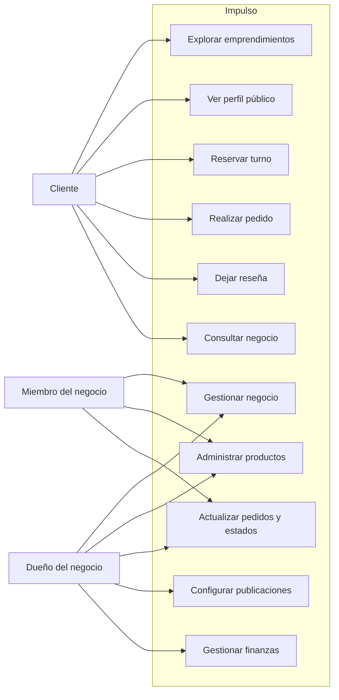
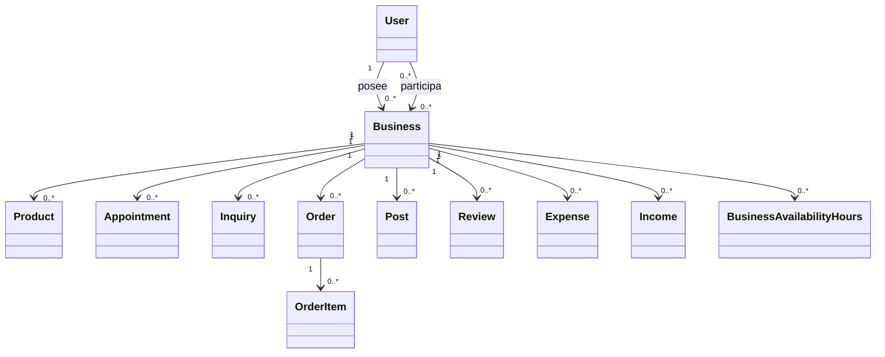
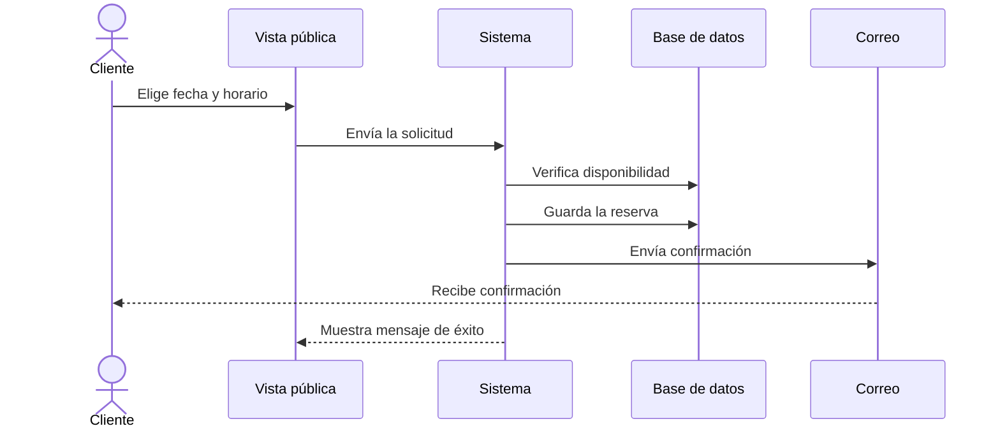
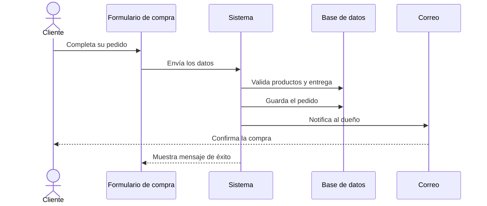
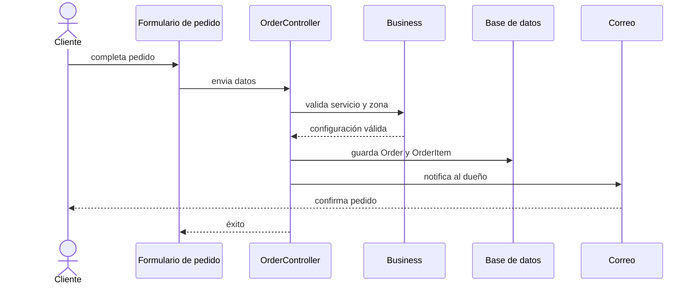

# Documento final del proyecto Impulso

## 1. Bienvenida

Este proyecto nació para ayudar a los emprendimientos locales a organizarse mejor en Internet. En lugar de usar muchas herramientas separadas, todos los procesos importantes se juntan en un mismo lugar: ventas, reservas, pedidos, publicaciones y administración del negocio.

La idea principal es simple: que un negocio pueda trabajar más ordenado, vender mejor y ofrecer una experiencia más agradable para sus clientes.

---

## 2. ¿De qué trata este proyecto?

Impulso es una aplicación web que ayuda a un negocio a:

- mostrar quién es y qué ofrece,
- vender sus productos o servicios,
- recibir pedidos,
- gestionar turnos y horarios,
- atender consultas de clientes,
- publicar promos o novedades,
- controlar un poco su dinero y su inventario,
- trabajar con un equipo con permisos claros.

Es como una "oficina digital" para un emprendimiento.

---

## 3. El problema que resuelve

Muchos negocios pequeños usan varias herramientas a la vez:

- WhatsApp para ventas,
- Excel para llevar cuenta,
- papel o calendario para turnos,
- Instagram para promocionar,
- mensajes sueltos para consultas.

Eso hace que todo sea más lento, más desordenado y más fácil de equivocarse.

Impulso intenta unir todo eso en una sola solución, fácil de usar y pensada para negocios reales.

---

## 4. ¿Cuál es la idea principal?

La idea es poner al negocio en Internet de una manera ordenada y profesional, pero sin complicar demasiado la experiencia.

Por un lado, el cliente puede:

- entrar al perfil del emprendimiento,
- ver qué venden,
- reservar un turno,
- pedir un producto,
- dejar una opinión,
- consultar dudas.

Por otro lado, el dueño del negocio puede:

- editar la información del negocio,
- subir productos,
- revisar ventas y pedidos,
- aceptar o rechazar turnos,
- responder consultas,
- organizar su equipo.

---

## 5. Objetivos del proyecto

### Objetivo general

Crear una herramienta simple, útil y moderna para que los emprendimientos locales puedan gestionar mejor su negocio online.

### Objetivos concretos

- ayudar al negocio a vender más ordenadamente,
- facilitar la atención al cliente,
- mejorar la presencia digital del emprendimiento,
- reducir errores en ventas y reservas,
- ahorrar tiempo en tareas repetitivas,
- dar una base sólida para seguir creciendo más adelante.

---

## 6. ¿Quién usa la aplicación?

### Cliente o visitante

Es la persona que entra al negocio para ver sus productos, pedir algo o reservar un turno.

### Dueño del emprendimiento

Es quien administra todo. Suele ser la persona que necesita organizar la operación del negocio.

### Miembro del equipo

Puede colaborar con la gestión, según el permiso que le asigne el dueño.

---

## 7. Funcionalidades principales

### 7.1 Crear y personalizar el negocio

El dueño puede crear su emprendimiento y definir:

- nombre,
- categoría,
- descripción,
- ubicación,
- contacto,
- estilo visual del sitio.

### 7.2 Ver el negocio en Internet

Cada negocio tiene una vista pública donde los clientes pueden ver:

- información del local,
- productos,
- promociones,
- reseñas,
- publicaciones,
- contacto.

### 7.3 Gestionar productos

Se pueden registrar productos con:

- nombre,
- precio,
- descripción,
- stock,
- categoría,
- disponibilidad.

### 7.4 Reservar turnos

Si el negocio lo habilita, los clientes pueden elegir un horario disponible y reservarlo. El sistema valida que ese horario esté libre antes de confirmar.

### 7.5 Pedidos

Los clientes pueden pedir productos con dos modalidades:

- retiro en el local,
- entrega a domicilio.

El sistema calcula el total y, si corresponde, el costo del envío.

### 7.6 Consultas

Los clientes pueden escribir una consulta desde la vista pública. El dueño puede responderla desde su panel.

### 7.7 Publicaciones y promociones

El negocio puede publicar novedades, promociones o servicios destacados para mantener a sus clientes informados.

### 7.8 Reseñas

Los clientes pueden dejar comentarios y calificaciones, lo que aporta confianza y ayuda a otros usuarios a conocer mejor el emprendimiento.

### 7.9 Finanzas básicas

El sistema permite registrar:

- gastos,
- ingresos,
- movimientos del negocio,
- control mínimo de caja.

---

## 8. ¿Qué es lo más importante del sistema?

La parte más valiosa es que une dos cosas en una sola solución:

1. lo que ve el cliente,
2. lo que usa el dueño para operar.

Esto hace que la experiencia sea más clara, más ordenada y más profesional para todos.

---

## 9. Tecnologías usadas

El proyecto está construido con tecnologías modernas y fáciles de mantener:

- PHP 8.2
- Laravel 12
- Blade
- Vite
- Tailwind CSS
- SQLite para entorno local
- PHPUnit para pruebas

Estas herramientas permiten que el proyecto sea más estable, ordenado y escalable.

---

## 10. Cómo funciona el sistema

El sistema se organiza en varias partes:

- la parte pública, donde está la información del negocio,
- la parte del negocio, donde se administra todo,
- la base de datos, donde se guardan todos los datos,
- la lógica del sistema, que valida operaciones y controla reglas del negocio.

Todo esto hace que el proyecto sea fácil de entender y mantener.

---

## 11. Diagramas UML

### 11.1 Casos de uso



### 11.2 Diagrama de clases



### 11.3 Diagrama de secuencia de reserva



### 11.4 Diagrama de secuencia de pedido



---

## 12. Seguridad básica

El proyecto incluye medidas importantes para cuidar la información y el acceso:

- cada usuario tiene su propia sesión,
- hay control por roles y permisos,
- los datos se validan antes de guardarlos,
- se controlan los accesos a funciones internas,
- se evita que un usuario no autorizado haga cambios en un negocio ajeno.

---

## 13. Pruebas

El proyecto cuenta con pruebas para verificar que las funciones más importantes funcione bien. Se revisa que:

- un usuario pueda reservar un turno,
- un cliente pueda dejar una reseña,
- un dueño pueda gestionar su negocio,
- un pedido con entrega pueda validarse,
- el sistema envíe correos relevantes,
- los estados de turnos y pedidos cambien correctamente.

---

## 14. Qué hace que este proyecto sea útil

Impulso sirve para:

- ordenar la operación diaria del emprendimiento,
- facilitar la venta online,
- mejorar la atención al cliente,
- dar presencia profesional en Internet,
- ahorrar tiempo y reducir errores,
- prepararse para crecer en el futuro.

---

## 15. Fase de crecimiento

Este proyecto ya tiene una base sólida, pero puede seguir creciendo con más funciones, por ejemplo:

- pagos online,
- reportes más avanzados,
- gestión de varias sucursales,
- integraciones con WhatsApp,
- dashboards con métricas,
- automatizaciones y recordatorios.

---

## 16. Conclusión

Impulso es un proyecto simple de entender, útil en la práctica y pensado para ayudar a los negocios locales a digitalizarse sin complicaciones.

No es solo una página web; es una herramienta para organizar el negocio, vender mejor y ofrecer una experiencia más profesional a los clientes.

Es una solución real, clara y con mucho potencial para seguir creciendo.

---

## 17. Cierre

Este documento fue pensado para que cualquier persona, incluso sin experiencia técnica, pueda entender qué es el proyecto, para qué sirve y cómo ayuda a un emprendimiento.

Si te sirve, también puedo dejarte una versión todavía más corta, tipo "presentación para explicar en 2 minutos" o una versión más formal para entregar a un cliente o profesor.

    Front->>Ctrl: Solicita reserva
    Ctrl->>Business: valida disponibilidad
    Business-->>Ctrl: horario disponible
    Ctrl->>DB: crea Appointment
    Ctrl->>Mail: envia confirmación
    Mail-->>Cliente: correo recibido
    Ctrl-->>Front: mensaje de éxito
```

## 14. Diagrama de secuencia de pedido



## 15. Descripción funcional detallada

### 15.1 Publicación del negocio

El usuario puede crear un perfil del negocio con información comercial, ubicación, descripción y contacto. Además, puede personalizar sus colores, fondos y estilo visual para mejorar su identidad digital.

### 15.2 Gestión de catálogo

Desde el panel del negocio se pueden registrar productos, asignar precio, controlar stock y mantener actualizada la oferta. Esta parte permite a la empresa vender más ordenadamente y reducir errores de inventario.

### 15.3 Administración de turnos

El negocio define sus días y horarios de atención. El sistema calcula automáticamente los horarios disponibles para ofrecer servicio y evitar conflictos de agenda.

### 15.4 Pedidos y entregas

El cliente puede elegir entre retiro o entrega. Si se activa delivery, el sistema valida el radio de cobertura y calcula el costo del envío. El pedido queda registrado con distintos estados para su gestión interna.

### 15.5 Consultas y soporte

Los clientes pueden enviar mensajes desde la vista pública del emprendimiento. El propietario responde y actualiza el estado, registrando un historial de atención.

### 15.6 Publicaciones y contenido

El negocio puede publicar promociones o contenido destacable. También puede decidir si compartirlo en redes sociales, reforzando el marketing digital del lugar.

### 15.7 Reseñas

Los clientes pueden dejar valoración y comentarios, permitiendo generar reputación digital para el negocio.

## 16. Seguridad

La aplicación incorpora medidas de seguridad básicas del framework Laravel, entre ellas:

- autenticación de usuarios,
- control de acceso según rol y permisos,
- validación de entradas y formularios,
- protección ante errores de lógica de negocio,
- restricciones en reservas, pedidos y gestión del negocio.

## 17. Pruebas realizadas

El proyecto contempla pruebas funcionales para validar los principales flujos del sistema, entre ellos:

- acceso a negocio público,
- creación de reservas,
- confirmación por correo,
- gestión de pedidos,
- cálculo de delivery,
- revisión de estados,
- manejo de publicaciones y reseñas.

## 18. Riesgos y mitigaciones

### Riesgos

- crecimiento de alcance sin control,
- complejidad en una futura expansión de permisos,
- necesidad de reportes más avanzados,
- integración de pagos y correos en producción,
- falta de métricas analíticas.

### Mitigaciones

- mantener la base funcional enfocada,
- priorizar módulos críticos,
- reforzar pruebas antes de escalar,
- definir roadmap por etapas,
- preparar el sistema para nuevas integraciones.

## 19. Plan de trabajo sugerido

### Fase 1: base operativa

- negocio,
- catálogo,
- reservas,
- pedidos,
- consultas,
- panel administrativo.

### Fase 2: optimización

- reportes,
- dashboard ejecutivo,
- finanzas avanzadas,
- notificaciones y automatizaciones.

### Fase 3: crecimiento

- pagos online,
- multi-sucursal,
- reportes más completos,
- preparacion para escalabilidad empresarial.

## 20. Conclusión

Impulso es un proyecto con una propuesta clara y útil para el mercado de emprendimientos locales. Integra la gestión del negocio con su presencia digital y genera una base sólida para mejorar la experiencia del cliente, optimizar las operaciones internas y profesionalizar la operación diaria.

La solución actual marca una base funcional sólida, con capacidad de ampliación y mejora continua. Es una plataforma pensada para representar un paso real hacia la digitalización del comercio local con un enfoque operativo, práctico y escalable.

---

## 21. Firma del documento

Documento preparado para entrega final del proyecto Impulso.

Fecha: 17/09/2026
