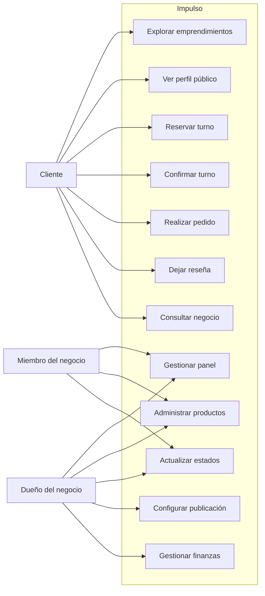

# Casos de uso UML

## Diagrama de casos de uso

## Descripción de los casos principales

### Cliente

- Explora emprendimientos según categoría o ubicación.
- Revisa perfil público con información, fotos y publicaciones.
- Reserva turno si el negocio tiene disponibilidad.
- Confirma la reserva por correo cuando corresponde.
- Hace pedidos con retiro o envío.
- Deja reseñas y consulta al negocio.

### Dueño / administrador

- Crea y personaliza el negocio.
- Gestiona productos, precios y stock.
- Revisa turnos y pedidos pendientes.
- Actualiza estados de órdenes, consultas y reservas.
- Configura publicaciones y apariencia pública.
- Gestiona gastos, ingresos y movimiento de caja.

### Miembro del equipo

- Accede a funciones del negocio según permisos.
- Colabora con gestión operativa del emprendimiento.

## Conclusión

El sistema centraliza dos tipos de actores principales: consumidores y administradores del negocio. El diagrama refleja un modelo orientado a operaciones cotidianas y relaciones directas entre cliente y emprendimiento.
