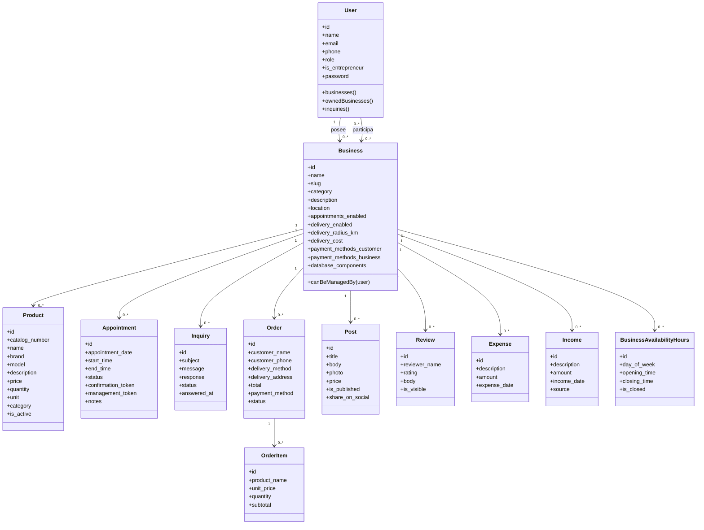

# Diagrama de clases UML

## Observaciones del modelo

- User puede ser dueño o miembro de varios negocios.
- Business centraliza la información del emprendimiento y las reglas de gestión.
- Product y Order son claves para el flujo comercial del negocio.
- Appointment representa la disponibilidad del servicio y la reserva del cliente.
- Inquiry encierra la relación de contacto y soporte.
- Expense e Income permiten una operación financiera básica.

## Relación funcional destacada

El modelo refleja una estructura centrada en Business como entidad principal. Todo el ciclo de operación del emprendimiento gira alrededor de su usuario propietario, sus miembros, la oferta comercial y las transacciones con clientes.
