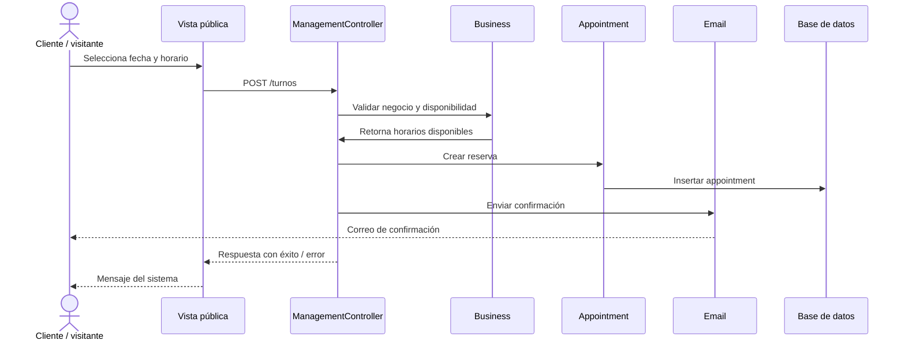
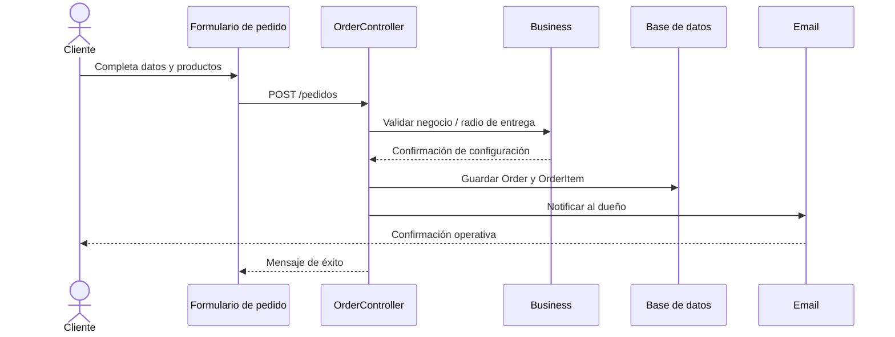

# Diagrama de secuencia UML

## Flujo de reserva de turno

## Descripción del flujo

1. El cliente accede a la vista pública del negocio.
2. El sistema valida el horario solicitado y la disponibilidad del negocio.
3. Si el horario está libre, se crea un registro de Appointment.
4. Si el cliente es invitado, se genera confirmación por email.
5. El negocio puede luego gestionar la reserva desde el panel administrativo.

## Flujo alternativo para pedido con delivery

## Conclusión

Los diagramas de secuencia muestran cómo se gestionan los flujos más críticos del sistema: reservas y pedidos. Ambos caminos validan negocio, persisten datos y entregan retroalimentación al cliente o al dueño del negocio.
