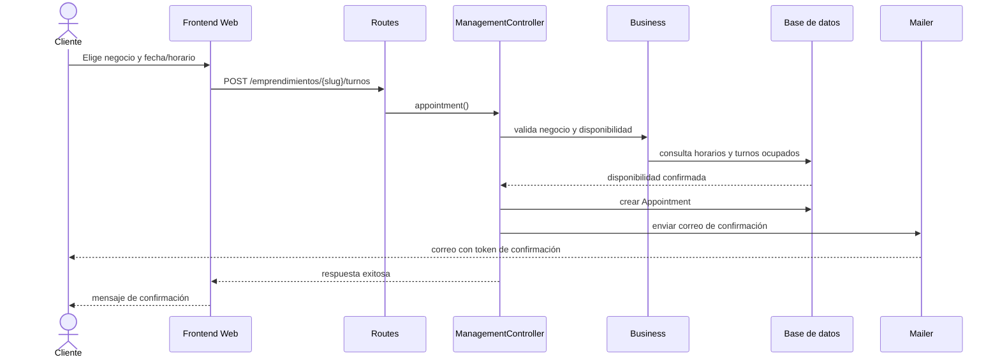
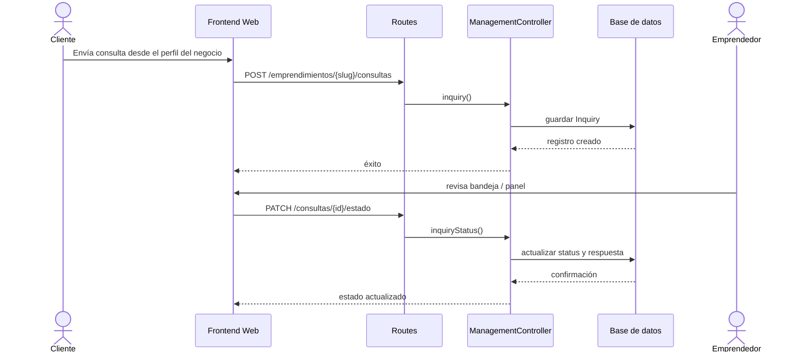
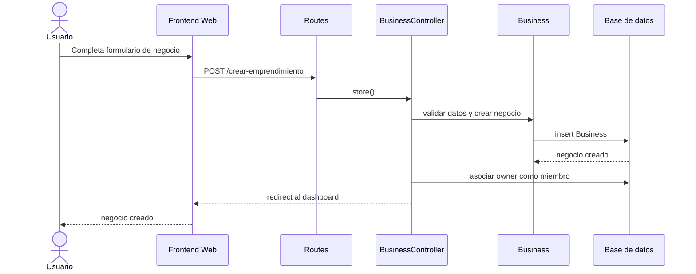
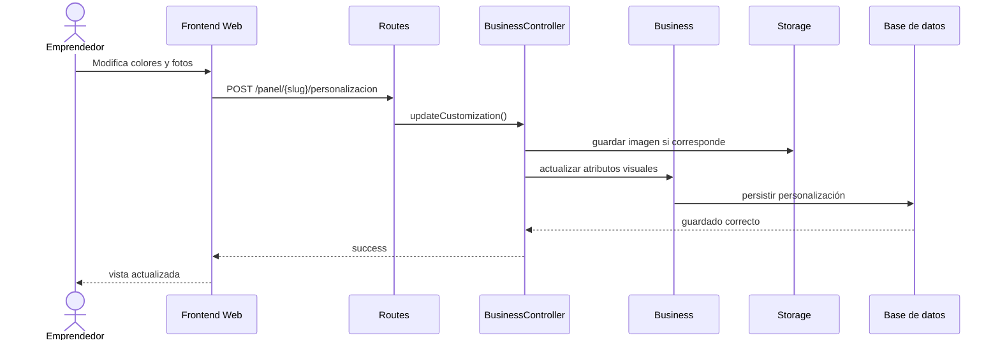

# Diagrama de secuencia

## Reserva de turno

```mermaid
sequenceDiagram
    actor Cliente
    participant Web as Frontend Web
    participant Route as Routes
    participant Controller as ManagementController
    participant Business as Business
    participant DB as Base de datos
    participant Mail as Mailer

    Cliente->>Web: Elige negocio y fecha/horario
    Web->>Route: POST /emprendimientos/{slug}/turnos
    Route->>Controller: appointment()
    Controller->>Business: valida negocio y disponibilidad
    Business->>DB: consulta horarios y turnos ocupados
    DB-->>Controller: disponibilidad confirmada
    Controller->>DB: crear Appointment
    Controller->>Mail: enviar correo de confirmación
    Mail-->>Cliente: correo con token de confirmación
    Controller-->>Web: respuesta exitosa
    Web-->>Cliente: mensaje de confirmación
```

## Gestión de consulta

```mermaid
sequenceDiagram
    actor Cliente
    participant Web as Frontend Web
    participant Route as Routes
    participant Controller as ManagementController
    participant DB as Base de datos
    actor Emprendedor

    Cliente->>Web: Envía consulta desde el perfil del negocio
    Web->>Route: POST /emprendimientos/{slug}/consultas
    Route->>Controller: inquiry()
    Controller->>DB: guardar Inquiry
    DB-->>Controller: registro creado
    Controller-->>Web: éxito
    Emprendedor->>Web: revisa bandeja / panel
    Web->>Route: PATCH /consultas/{id}/estado
    Route->>Controller: inquiryStatus()
    Controller->>DB: actualizar status y respuesta
    DB-->>Controller: confirmación
    Controller-->>Web: estado actualizado
```

## Creación de negocio

```mermaid
sequenceDiagram
    actor Usuario
    participant Web as Frontend Web
    participant Route as Routes
    participant Controller as BusinessController
    participant Model as Business
    participant DB as Base de datos

    Usuario->>Web: Completa formulario de negocio
    Web->>Route: POST /crear-emprendimiento
    Route->>Controller: store()
    Controller->>Model: validar datos y crear negocio
    Model->>DB: insert Business
    DB-->>Model: negocio creado
    Controller->>DB: asociar owner como miembro
    Controller-->>Web: redirect al dashboard
    Web-->>Usuario: negocio creado
```

## Módulo de personalización pública

```mermaid
sequenceDiagram
    actor Emprendedor
    participant Web as Frontend Web
    participant Route as Routes
    participant Controller as BusinessController
    participant Business as Business
    participant Storage as Storage
    participant DB as Base de datos

    Emprendedor->>Web: Modifica colores y fotos
    Web->>Route: POST /panel/{slug}/personalizacion
    Route->>Controller: updateCustomization()
    Controller->>Storage: guardar imagen si corresponde
    Controller->>Business: actualizar atributos visuales
    Business->>DB: persistir personalización
    DB-->>Controller: guardado correcto
    Controller-->>Web: success
    Web-->>Emprendedor: vista actualizada
```
