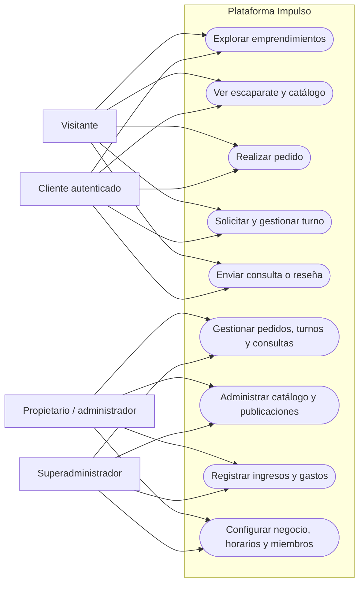
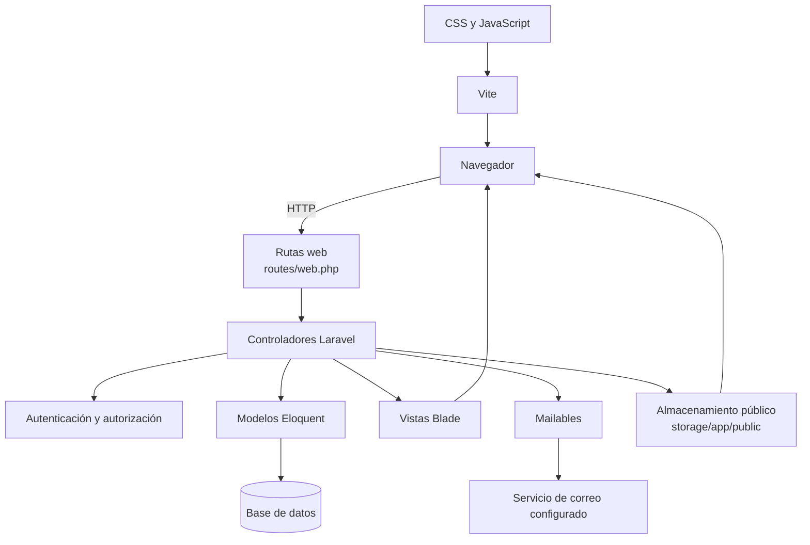
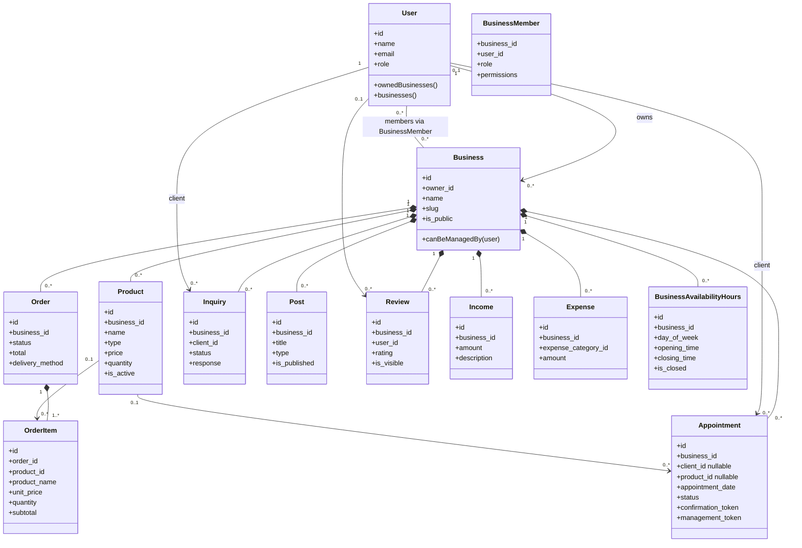
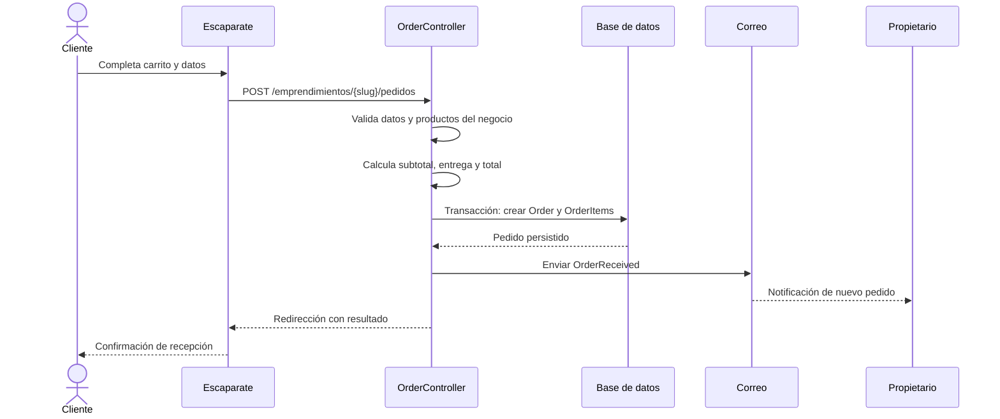
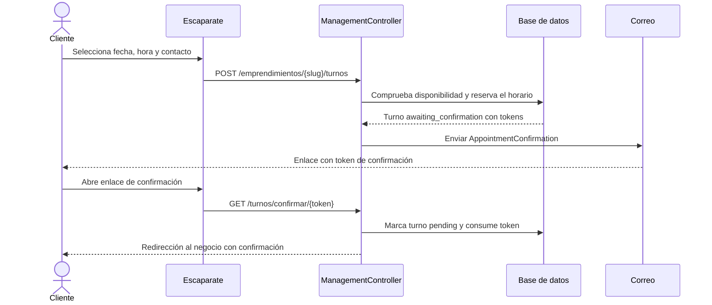

# Arquitectura de Impulso

> Documento técnico del sistema. Los diagramas describen el comportamiento y las relaciones implementadas actualmente; no representan funcionalidades futuras.

## 1. Propósito y alcance

Impulso es una aplicación web multiemprendimiento. Cada negocio dispone de una página pública para presentar su catálogo, publicaciones y formas de contacto, y de un panel privado para operar el negocio. Los clientes pueden explorar la oferta, iniciar pedidos, solicitar turnos y, cuando inician sesión, enviar consultas o reseñas.

La aplicación está construida como un monolito Laravel: las rutas web coordinan controladores, los modelos Eloquent representan el dominio persistido y las vistas Blade entregan las páginas. Vite compila los recursos de interfaz.

## 2. Actores y permisos

| Actor | Capacidades principales |
| --- | --- |
| Visitante | Explorar negocios, consultar catálogos, solicitar un turno como invitado y publicar una reseña. |
| Cliente autenticado | Enviar consultas y reseñas; puede solicitar turnos asociado a su cuenta. |
| Propietario o administrador del negocio | Gestionar el panel, catálogo, publicaciones, operaciones y miembros del negocio. |
| Superadministrador | Puede gestionar los negocios a través de la regla central de autorización del modelo `Business`. |

Las rutas del panel exigen autenticación. Las operaciones de gestión verifican que el usuario sea propietario, superadministrador o miembro con rol `owner` o `administrator`. La elegibilidad se centraliza en `Business::canBeManagedBy()`.

### Diagrama de casos de uso



## 3. Componentes y responsabilidades

| Componente | Responsabilidad |
| --- | --- |
| `routes/web.php` | Define páginas públicas, autenticación y operaciones del panel. |
| Controladores HTTP | Validan solicitudes, aplican reglas del caso de uso y coordinan modelos, correo y respuestas. |
| Modelos Eloquent | Representan negocios, cuentas, catálogo, pedidos, turnos y registros administrativos. |
| Migraciones | Mantienen versionado el esquema y sus claves foráneas. |
| Vistas Blade | Renderizan páginas públicas, formularios y paneles. |
| Mailables | Envían confirmaciones de turno y avisos de pedido. |
| Vite | Compila estilos y recursos JavaScript para desarrollo y producción. |

### Diagrama de componentes



## 4. Modelo de dominio

Un `Business` pertenece a un usuario propietario y tiene colecciones de catálogo, pedidos, turnos y otros registros. Los miembros se relacionan mediante `business_members`, que almacena rol y permisos. Un pedido puede tener varios `OrderItem`; cada renglón conserva el nombre y precio unitario del producto al momento de compra. Un producto también puede asociarse a pedidos y turnos.

Los turnos admiten `client_id` nulo para clientes invitados; la confirmación y administración de esos turnos se hace mediante tokens enviados en enlaces. Las consultas requieren un usuario autenticado. Los registros financieros se mantienen separados: `Income` y `Expense` pertenecen al negocio.

### Diagrama de clases y relaciones



## 5. Flujos principales

### Pedido desde el escaparate

El cliente envía datos de contacto, entrega/retiro, pago y productos. El servidor valida que los productos estén activos y pertenezcan al negocio, calcula los importes a partir de precios leídos desde la base de datos y crea pedido e ítems dentro de una transacción. Luego envía un correo al propietario. El negocio actualiza el estado desde su panel.

### Diagrama de secuencia: pedido



### Diagrama de secuencia: turno de invitado



## 6. Rutas por área

Las rutas están declaradas en `routes/web.php` y siguen esta organización:

| Área | Rutas representativas | Acceso |
| --- | --- | --- |
| Inicio y exploración | `/`, `/explorar` | Público |
| Escaparate | `/emprendimientos/{slug}` | Público |
| Pedidos | `/emprendimientos/{slug}/pedidos` | Público |
| Turnos | `/emprendimientos/{slug}/turnos`, `/turnos/confirmar/{token}` | Público, sujeto a disponibilidad |
| Cuenta | `/ingresar`, `/registrarse`, `/salir` | Invitado / autenticado |
| Panel | `/panel/{slug}` y subrutas | Autenticado y autorizado para el negocio |
| Bandeja | `/bandeja` | Autenticado |
| Consultas | `/emprendimientos/{slug}/consultas` | Cliente autenticado |
| Reseñas | `/emprendimientos/{slug}/reseñas` | Público; la cuenta se asocia cuando hay una sesión autenticada |

## 7. Persistencia y datos

El esquema evoluciona con migraciones Laravel en `database/migrations`. Las tablas funcionales principales incluyen `users`, `businesses`, `business_members`, `products`, `orders`, `order_items`, `appointments`, `inquiries`, `posts`, `reviews`, `incomes`, `expenses`, `expense_categories`, `social_links` y `business_availability_hours`.

Las relaciones de negocio usan claves foráneas. Por ejemplo, los elementos de pedido se eliminan junto con su pedido; un producto borrado puede quedar desvinculado de pedidos y turnos, mientras el renglón conserva una copia del nombre y precio histórico. El campo `slug` identifica la página pública. Las opciones de personalización y ciertos atributos flexibles se almacenan en columnas JSON.

## 8. Configuración, correo y archivos

- La configuración sensible y por entorno se define en `.env`; no se debe versionar ese archivo.
- El correo usa el mailer configurado por Laravel mediante variables `MAIL_*`.
- Los archivos públicos subidos usan el disco público de Laravel: `storage/app/public`.
- El enlace público se prepara con `php artisan storage:link`; `composer run setup` lo crea si falta.
- Los recursos CSS/JavaScript se compilan con Vite mediante `npm run build`.

## 9. Desarrollo y calidad

Desde la raíz del repositorio:

```bash
composer run setup
composer run dev
composer run test
```

`composer run dev` inicia servidor web, Vite, escucha de cola y visor de logs. Para ejecutar una única aplicación sin los procesos auxiliares, se puede usar `php artisan serve` y, en otra terminal, `npm run dev`.

La suite automática está en `tests/Feature` y `tests/Unit`. Antes de cambios en reglas de negocio, ejecutar `composer run test` y añadir pruebas de regresión para el flujo afectado.

## 10. Límites conocidos del diseño

- El código de rutas web y las vistas conforman una aplicación Laravel monolítica; no se documenta una API pública separada.
- Los estados de pedidos, turnos y consultas se manejan como valores de texto definidos en los controladores.
- Los correos se envían mediante el mailer de Laravel; su entrega efectiva depende de la configuración externa del entorno.
- El diagrama de clases muestra relaciones principales del dominio, no todas las columnas ni cada accessor del modelo.